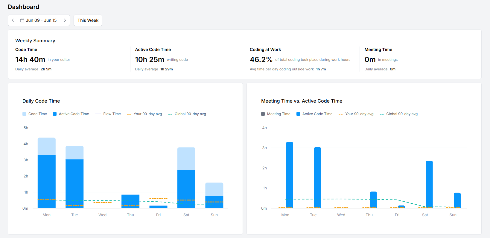

# 🎵 Rhythm Riddle

A fun music guessing game that lets music enthusiasts test their knowledge through audio snippets!

[English](#english) | [中文](README.md)

## Overview

**Rhythm Riddle** is an engaging music guessing game where players identify songs, artists, albums, and genres by listening to short audio clips. Built with Flutter, it provides a seamless cross-platform experience on Android, IOS, Windows, and Linux.

> **Note:** The project is under development and needs your [help and contributions](#contributing)!

## ✨ Features

### Completed ✅
- **Cross-platform Support**: Runs on Android, IOS, Windows, Mac, and Linux (Self compile required)
- **Internationalization**: Supports both English and Chinese using intl
- **Login System** : Uses token to save login state 
- **Home Page Playlist Display**
- **Account Management**
- **Playlist Info Page** (Responsive UI for both large and small devices)
- **Single Player Mode** (Basic Features)
- **Difficulty System**: Easy, Medium, Hard
- **Search Page** (In Progress)

### In Development 🚧
- **Music Library Expansion**: [Want to add songs and playlists?](#adding-songs)
- **Player Community**: Create your own playlists
- **Multiplayer Mode**: Compete with friends
- **Customization Options**:
  - Music playback duration
  - Playback position
  - Answer format (Fill-in, Multiple Choice)
  - Hints availability
- **Scoring System**: Earn points for correct guesses
- **Leaderboard**: Compete with players worldwide

## 🛠️ Tech Stack

- **Flutter**: Cross-platform mobile and desktop development framework
- **Dart**: Programming language used by Flutter
- **PHP**: Backend API development
- **MySQL**: Data storage (Considering if to migrate to PostgreSQL)

## 📊 Development Progress

## 🤝 Contributing

We welcome all forms of contributions! Contributors will be listed in the [Special Thanks](#special-thanks) section.

### How to Contribute
1. Fork the repository
2. Create your feature branch (`git checkout -b feature/AmazingFeature`)
3. Commit your changes (`git commit -m 'Add some AmazingFeature'`)
4. Push to the branch (`git push origin feature/AmazingFeature`)
5. Open a Pull Request

### Adding Songs
The database needs more songs and playlists. For data security, only administrators can add songs. Please [contact me](#contact) if you'd like to contribute songs.

## ☕ Support the Project

Like this project? [Buy me a coffee](http://hungryhenry.xyz/reward.html) to support development!

## 📄 License

This project is licensed under the [GNU General Public License v3.0](LICENSE).

> **Note:** This software is for personal learning, research, or non-commercial use only. Commercial use is prohibited.

## Contact

- 📧 Email: [hungryhenry101@outlook.com](mailto:hungryhenry101@outlook.com)
- 🎥 Bilibili: [HungryHenry](https://space.bilibili.com/672872726)

## 🙏 Special Thanks

- Spidy: A cup of iced Americano
- Yueran: A cup of iced Americano
- eeeCY: Server Support

---

Made with ❤️ by HungryHenry

 